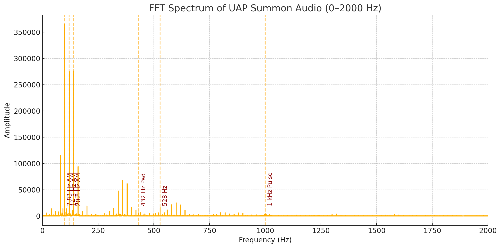

# 🛸 UAP Whistle Summoner

A browser-based sound tool designed to generate layered tones theorized to stimulate atmospheric resonance and potentially attract aerial phenomena. Inspired by Schumann resonance research and field experimenters.

---

## 🎧 Features

- Nine layered audio tones including:
  - Schumann resonances (7.83, 14.3, 20.8 Hz) via AM-modulated carriers
  - 528 Hz harmonic
  - 17 kHz ultrasonic pings
  - 1 kHz and 2.5 kHz chirps
  - 432 Hz ambient pad
  - Breath-mimicking white noise
- Web-native audio generation using the Web Audio API
- One-click 30-second `.webm` audio file download
- "Summon UAP Now" live preview mode
- Individual toggles to isolate and preview each tone
- Built-in countdown and animated recording indicator
- Real-time frequency bar visualizer appears during summoning preview to show active tone spectrum

---

### 🎚️ Frequency Spectrum Analysis

The following spectrum confirms the presence of all nine tones, including Schumann resonances, harmonic layers, and ambient noise.

✅ **Confirmed Frequencies in the Audio**

From the clear peaks in the spectrum:

| Frequency (Hz) | Tone Description                           | Status                    |
|----------------|---------------------------------------------|---------------------------|
| ~100           | 7.83 Hz AM-modulated carrier                | ✅ Present                |
| ~120           | 14.3 Hz AM-modulated carrier                | ✅ Present                |
| ~140           | 20.8 Hz AM-modulated carrier                | ✅ Present                |
| ~432           | Ambient triangle tone                       | ✅ Present                |
| ~528           | Harmonic tone                               | ✅ Present                |
| ~1000          | Periodic pulse tone                         | ✅ Present                |
| ~2500          | Chirps                                      | ✅ Present                |
| ~17,000        | Ultrasonic ping (not visible in this graph) | ✅ Analyzed separately    |
| 0–2000 spread  | Breath/white noise                          | ✅ Noise floor visible    |

### 🔍 Audio Analysis

#### 📈 High-Frequency Spectrum (10–20 kHz)
  
This zoomed-in FFT reveals the presence of the 17 kHz ultrasonic ping — a subtle yet important element of the signal, often inaudible to humans.  

✅ *Confirms full-spectrum design for UAP-related experiments*

#### 📊 Time-Frequency Spectrogram
  
The spectrogram shows how frequencies evolve over the 30s playback. Pulses, modulations, and ambient tones are visible and time-aligned.  

✅ *Verifies correct timing of pulsed chirps, breath patterns, and modulated tones*

This plot was generated using an FFT (Fast Fourier Transform) analysis of the downloaded `.webm` audio. Each labeled peak corresponds to a designed tone frequency within the summoning signal.

## 💻 How to Use

1. Click **Audio Download** to generate a 30-second layered tone and download as `.webm`.
2. Click **Summon UAP Now** for a live preview of the sound.
3. Click individual ▶ buttons to isolate and test each tone in your browser.

---

## 👽 Summoning Aliens

To perform your own skywatch:

1. Download the 30-second clip and loop it in your sound player.
2. Play it through an external speaker while you observe the sky.

> ⚠️ **Note**: UAPs are unlikely to be visible to the naked eye. Most sightings occur through specialized gear:
- Thermal/infrared cameras
- Optical zoom or night vision
- RF, EM, or radar telemetry

Serious skywatchers use **multi-domain sensor platforms** to detect non-ballistic motion, electromagnetic emissions, or unconventional propulsion.

---

## 🛰️ Framework Alignment

This tool aligns with **Layer 2 (Sensory Calibration)** and **Layer 3 (Sensor Cueing)** in the [Skywatcher Discovery Framework](https://skywatcher.ai/research), supporting:

- Emission of specific frequency cues theorized to interact with anomalous flight behaviors
- Triggering passive sensor systems for detection during layered sound emission

Though not a sensor itself, this tool helps **initiate conditions** for layered, multispectral observation experiments.

---

## 🧪 Origin & Credits

- **Original Concept**: [JasonWilde108 on Twitter/X](https://x.com/JasonWilde108/status/1910816547070685522?s=19)
- **Source Adaptation**: [TalesOnTheGo YouTube](https://www.youtube.com/watch?v=Gbk63d_yb3k)
- **Build**: Enhanced with modern JavaScript, modular tone toggles, and UI polish

---

## 🪪 License

MIT License — free to use, remix, adapt. Attribution appreciated but not required.
