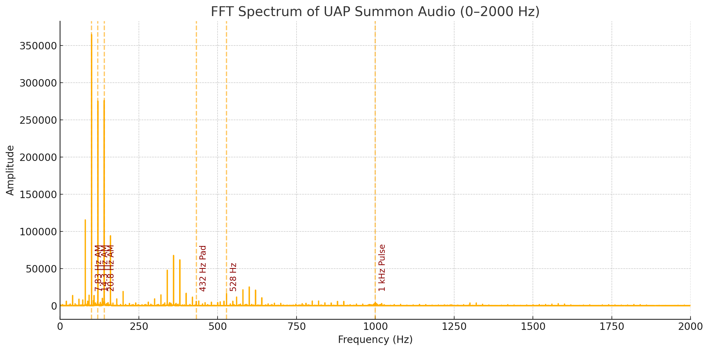
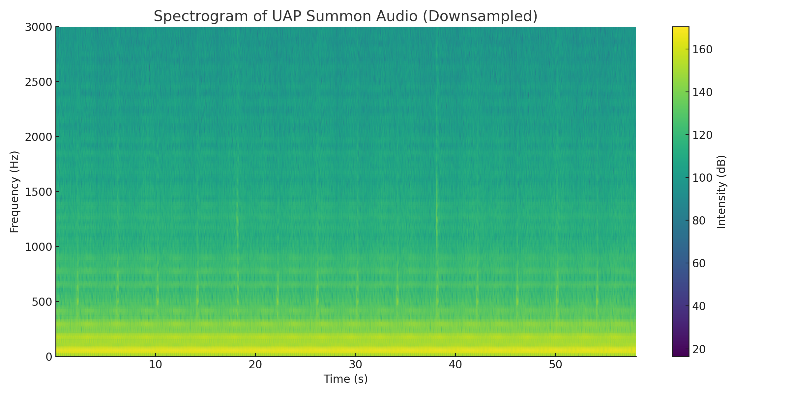

# 🛸 UAP Whistle Summoner

A browser-based sound tool designed to generate layered tones theorized to stimulate atmospheric resonance and potentially attract aerial phenomena. Inspired by Schumann resonance research and field experimenters.

---

## 🎧 Features

- Nine layered audio tones including:
  - Schumann resonances (7.83, 14.3, 20.8 Hz) via AM-modulated carriers
  - 528 Hz harmonic
  - 17 kHz ultrasonic pings
  - 1 kHz and 2.5 kHz chirps
  - 432 Hz ambient pad
  - Breath-mimicking white noise
- Web-native audio generation using the Web Audio API
- One-click 60-second `.webm` audio file download
- **SUMMON / LIVE PREVIEW** mode (with real-time interactive channel active states)
- Individual play/pause toggles and volume sliders to isolate, mix, and preview each tone
- **Command Console**:
  - Top-aligned Reset button dynamically communicates its state (medium grey when clickable, light gray when disabled)
  - Revamped classic pulsing red recording pill with white text and bullet dot
  - Monospace dark box countdown timer
  - Stabilized "RESONANCE" status telemetry badge with min-width constraints to prevent mobile layout shifting
- **Collapsible UAP Summoning Guide**: A default-collapsed details briefing panel summarizing key summoning instructions, sensor cueing, and framework research links
- Real-time frequency bar, oscilloscope, and radial radar visualizers rendering on a clean, light canvas
- Highly readable layout utilizing **Inter** sans-serif font and condensed padding to maximize above-the-fold content visibility

---

### 🎚️ Frequency Spectrum Analysis

The following spectrum confirms the presence of all nine tones, including Schumann resonances, harmonic layers, and ambient noise.

✅ **Confirmed Frequencies in the Audio**

From the clear peaks in the spectrum:

| Frequency (Hz) | Tone Description                           | Status                    |
|----------------|---------------------------------------------|---------------------------|
| ~100           | 7.83 Hz AM-modulated carrier                | ✅ Present                |
| ~120           | 14.3 Hz AM-modulated carrier                | ✅ Present                |
| ~140           | 20.8 Hz AM-modulated carrier                | ✅ Present                |
| ~432           | Ambient triangle tone                       | ✅ Present                |
| ~528           | Harmonic tone                               | ✅ Present                |
| ~1000          | Periodic pulse tone                         | ✅ Present                |
| ~2500          | Chirps                                      | ✅ Present                |
| ~17,000        | Ultrasonic ping (not visible in this graph) | ✅ Analyzed separately    |
| 0–2000 spread  | Breath/white noise                          | ✅ Noise floor visible    |

### 🔍 Audio Analysis

#### 📈 High-Frequency Spectrum (10–20 kHz)
  
This zoomed-in FFT reveals the presence of the 17 kHz ultrasonic ping — a subtle yet important element of the signal, often inaudible to humans.  

✅ *Confirms full-spectrum design for UAP-related experiments*

#### 📊 Time-Frequency Spectrogram
  
The spectrogram shows how frequencies evolve over the 60s playback. Pulses, modulations, and ambient tones are visible and time-aligned.  

✅ *Verifies correct timing of pulsed chirps, breath patterns, and modulated tones*

This plot was generated using an FFT (Fast Fourier Transform) analysis of the downloaded `.webm` audio. Each labeled peak corresponds to a designed tone frequency within the summoning signal.

## 💻 How to Use

1. Open the **UAP Summoning Guide** at the top for field context and reference links.
2. Click **Summon Aliens** in the Command Console to trigger a 60-second live playback preview, or use individual play buttons (▶/⏸) and volume sliders on the **Frequency Mixer Board** to isolate, tune, and test each tone.
3. Click **Download WebM** inside the Command Console to generate and download a 60-second compiled signal as a `.webm` file.
4. Click the header **RESET** button (active when oscillators are initialized) to safely deactivate all playing channels, reset volume sliders to default levels, and close the audio context.

---

## 👽 Summoning Aliens

To perform your own skywatch:

1. Download the 60-second clip and loop it in your sound player.
2. Play it through an external speaker while you observe the sky.

> ⚠️ **Note**: UAPs are unlikely to be visible to the naked eye. Most sightings occur through specialized gear:
- Thermal/infrared cameras
- Optical zoom or night vision
- RF, EM, or radar telemetry

Serious skywatchers use **multi-domain sensor platforms** to detect non-ballistic motion, electromagnetic emissions, or unconventional propulsion.

---

## 🛰️ Framework Alignment

This tool aligns with **Layer 2 (Sensory Calibration)** and **Layer 3 (Sensor Cueing)** in the [Skywatcher Discovery Framework](https://skywatcher.ai/research), supporting:

- Emission of specific frequency cues theorized to interact with anomalous flight behaviors
- Triggering passive sensor systems for detection during layered sound emission

Though not a sensor itself, this tool helps **initiate conditions** for layered, multispectral observation experiments.

Per SkyWatcher:

"Our findings suggest that varying the method can apparently alter the “class” of UAPs that respond (where the class is defined as the form of the UAP as well as their flight characteristics). Colloquially we refer to this set of signatures as the "dog whistle". To be clear, this capability is entirely technology-driven. It involves deploying specific equipment in the field, configuring it in a precise manner, and executing defined 7 operational activities to elicit UAP responses. Through controlled testing, we have observed that control "dog whistles" (sets of randomly determined electronic signatures) fail to attract UAPs, whereas our refined techniques have to date never failed to elicit a response."

---

## 🧪 Origin & Credits

- **Original Concept**: [JasonWilde108 on Twitter/X](https://x.com/JasonWilde108/status/1910816547070685522?s=19)
- **Source Adaptation**: [TalesOnTheGo YouTube](https://www.youtube.com/watch?v=Gbk63d_yb3k)
- **Build**: Enhanced with modern JavaScript, modular tone toggles, and UI polish

---

## 🪪 License

MIT License — free to use, remix, adapt. Attribution appreciated but not required.
